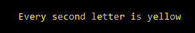
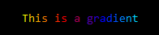
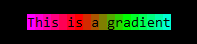
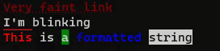
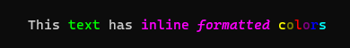

<div align="center">
    
    <h1><code>ANSI Console</code></h1>
    <p>
        Lightweight and flexible text formatter<br>
        for creating <em>beautiful</em> console applications.
		<br><br>
        
    	
        
        
    </p>
    <br><br>
</div>
## About

ANSI Console aims to be as **developer friendly and easy to use** as possible. The reason this library was created is because many of the already existing libraries doesn't provide a good user interface. The main purpose of this library is to fix this, console formatting should be **accessible and fun**!


## Install

```
> dotnet add package ANSI.Console
```

Or download `ANSI.Console` directly from [NuGet](https://www.nuget.org/packages/ANSI.Console).


## Features
* Color formatting using: `System.ConsoleColor`, `System.Drawing.Color`, **RGB**, **HEX**, **Named/known colors** ([list](https://docs.microsoft.com/en-us/dotnet/api/system.windows.media.brushes?view=net-5.0)) and **True color** (24-bit format with over 16.7 million colors, [Wikipedia](https://en.wikipedia.org/wiki/Color_depth#True_color_(24-bit)))
* Styles: Bold, Italic, Underlined, Overlined, Strike-through, Inverted, Faint, Opacity, Blink, Uppercase and Lowercase.
* Hyperlinks
* Custom inline formatting method `FormatANSI`.
* Chainable formatting methods.
* ANSI initialization for the system console (If not enabled already).
* Builds on-top of the default `Console` using `string` extension methods.
* Mapping methods using generators
* Gradients with unlimited colors

Learn more about ANSI escape sequences [here](https://stackoverflow.com/a/33206814/5698805).

### Initialization

One should always initialize the ANSI console mode before writing anything to the console. The line below will try to initialize returning true if successful. If initialization failed, disable all ANSI codes from being printed without needing to change any of your formatting logic. Colors and formatting is automatically disabled for systems with the `NO_COLOR` environment variable enabled, read more [here](#NO_COLOR).

```c#
if (!ANSIInitializer.Init(false)) ANSIInitializer.Enabled = false;
```

### Colors and styles

#### Colors

* Use regular `ConsoleColor`.

```c#
"My text".Color(ConsoleColor.Red)
```

* Or even better, any `Color`.

```c#
"My text".Color(Color.IndianRed)
```

* Too long still? Use just the color name.

```c#
"My text".Color("IndianRed")
```

* Want more control? Use hexadecimal color values.

```c#
"My text".Color("#775500")
```

* Or even RGB color values.

```c#
"My text".Color(256, 127, 0)
```

#### Styles

You can chain all formatting styles in any order.

```c#
"My text".Bold().Italic().Color("IndianRed").Underlined().StrikeThrough().Blink();
```

#### Opacity

Add opacity easily using `.Opacity(percent)`. `percent` must be between 0 and 100. The code below could be rewritten and improved using the map method below.

```c#
Console.WriteLine($"{"O".Opacity(10)}{"p".Opacity(20)}{"a".Opacity(30)}{"c".Opacity(50)}{"i".Opacity(60)}{"t".Opacity(80)}{"y".Opacity(90)}");
```


#### Links

Use `.Link()` if the text is also a valid URL. This only works on strings, and not if you have used any other formatting method before it.

```c#
"https://www.nuget.org/packages/ANSI.Console".Link().Bold();
```

If you fancy using a custom title, use `.Link(url)`. This can be used in any order in the chained formatting list.

```c#
"ANSI.Console".Bold().Link("https://www.nuget.org/packages/ANSI.Console");
```

#### Map

Use the `MapANSI` method to generate custom patterns, highlighting or anything else you can think of.

```c#
Console.WriteLine("Every second letter is yellow".MapANSI((c, i) => i % 2 == 0 ? c.Color(ConsoleColor.Yellow) : c.ToANSI()));
```




#### Gradients

Add text gradients interpolating between any amount of colors. The first argument is the background color.

```c#
Console.WriteLine("This is a gradient".Gradient(ANSIString.FromConsoleColor(Console.BackgroundColor), Color.Yellow, Color.Red, Color.Blue, Color.Cyan));
```




Or background gradients. The first argument is the foreground color. (Sadly the two cannot be combined yet. But maybe in a future release if there is interest)

```c#
Console.WriteLine("This is a gradient".GradientBackground(Color.Black, Color.Yellow, Color.Red, Color.Blue, Color.Cyan));
```




### Inline formatting using `FormatANSI`

Format text directly in line, applying the corresponding ANSI format in the formatting array to the matching **\`(color|(background|))text´** in the text.
Use **\`color|text´** to add foreground color, and **\`|background|text´** to only add background color.

#### Example: Only color

```c#
Console.WriteLine($"This `Green|text´ has `Black|Gray|inline {"formatted".Italic().NoClear()}´ `Yellow|c´`Orange|o´`Red|l´`Purple|o´`Blue|r´`Aqua|s´".FormatANSI());
```


#### Example: Multi formatted

```c#
Console.WriteLine("`Red|This´ is `|Green|a´ `Blue|formatted´ `string´".FormatANSI(ANSIFormatting.Bold | ANSIFormatting.Overlined, ANSIFormatting.None, ANSIFormatting.Blink, ANSIFormatting.Inverted));
```


### Inline colors using `FormatColor`

Unless you don't want any other formatting that colors, use this method instead. You don't need to specify the color in the text itself, but as arguments to the `FormatColor` method.

This is perfect if you want to quickly spice-up your console applications usage/about/help message or manual page.

```c#
Console.WriteLine($"This `text´ has `inline {"formatted".Italic().NoClear()}´ `c´`o´`l´`o´`r´`s´".FormatColor(ConsoleColor.Green, ConsoleColor.Magenta, ConsoleColor.Yellow, ConsoleColor.DarkYellow, ConsoleColor.Red, ConsoleColor.DarkMagenta, ConsoleColor.Blue, ConsoleColor.Cyan));
```




## NO_COLOR

No formatting will be applied for systems where console color output has explicitly been requested to be turned off using the environment variable `NO_COLOR`. See more information about this initiative at [https://no-color.org](https://no-color.org/).

This can be overwritten by setting the `ANSIInitializer.Enabled = true`.

## Resources

* [ANSI escape code](https://en.wikipedia.org/wiki/ANSI_escape_code)
* [List of ANSI color escape sequences](https://stackoverflow.com/a/33206814/5698805)
* [Hyperlinks (a.k.a. HTML-like anchors) in terminal emulators](https://gist.github.com/egmontkob/eb114294efbcd5adb1944c9f3cb5feda#the-escape-sequence), [Support hyperlink ansi escapes in the integrated terminal](https://github.com/microsoft/vscode/issues/39278)
* [Operating System Command (OSC)](https://chromium.googlesource.com/apps/libapps/+/a5fb83c190aa9d74f4a9bca233dac6be2664e9e9/hterm/doc/ControlSequences.md#OSC)

## Blogs

* [Build your own Command Line with ANSI escape codes](https://www.lihaoyi.com/post/BuildyourownCommandLinewithANSIescapecodes.html)
* [Using ANSI color codes in .NET Core Console applications](https://www.jerriepelser.com/blog/using-ansi-color-codes-in-net-console-apps/)
* [Spectre.Console lets you make beautiful console apps with .NET Core](https://www.hanselman.com/blog/spectreconsole-lets-you-make-beautiful-console-apps-with-net-core)

## Related projects

* [Spectre.Console](https://github.com/spectreconsole/spectre.console)
* [Colorful.Console](https://github.com/tomakita/Colorful.Console)
* [Pastel](https://github.com/silkfire/Pastel)
* [rich](https://github.com/willmcgugan/rich)
* [Spectre.Terminals](https://github.com/spectreconsole/terminal)
* [System.Terminal](https://github.com/alexrp/system-terminal)
